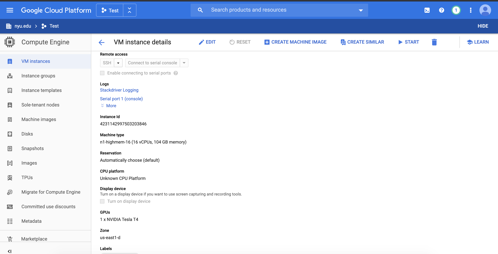
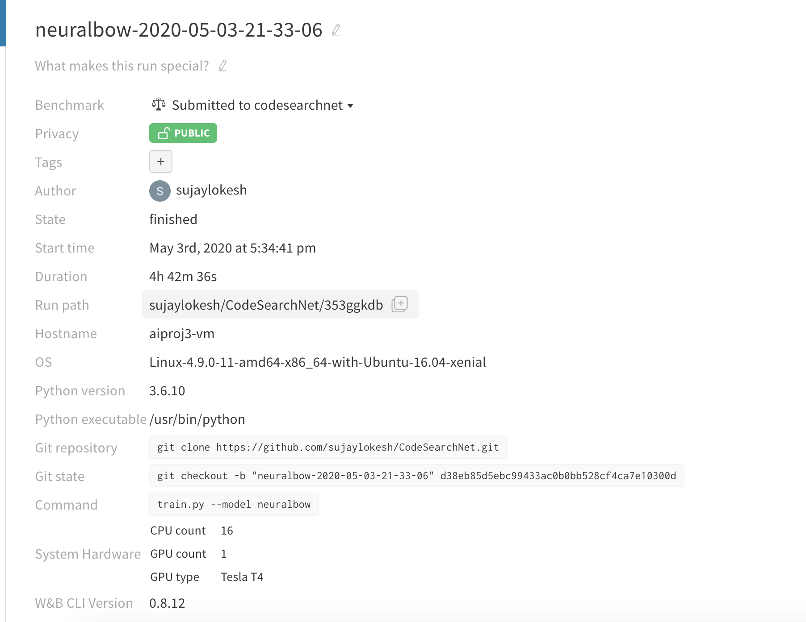
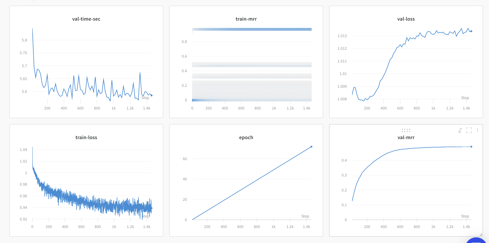
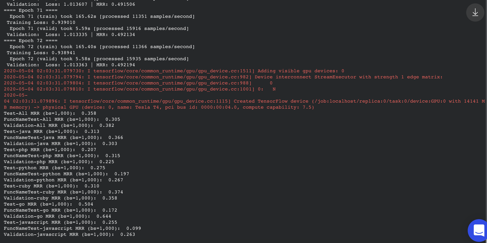
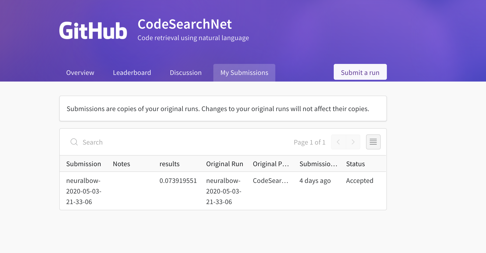
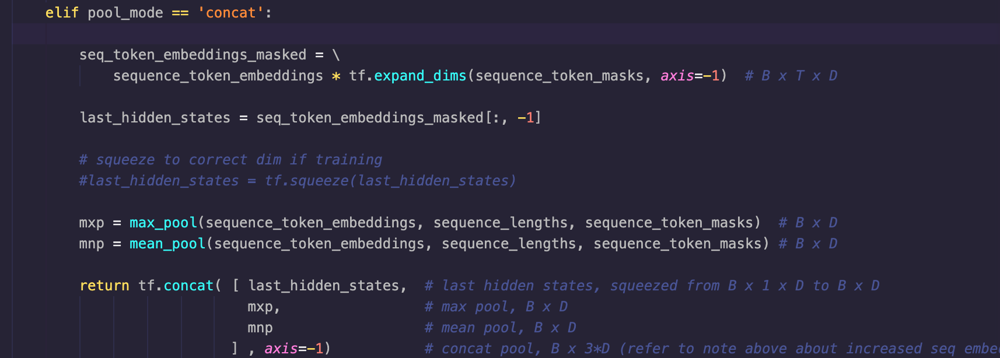

 [](https://opensource.org/licenses/MIT)  [](https://www.python.org/downloads/release/python-360/)
[](https://app.wandb.ai/github/CodeSearchNet/benchmark)

[paper]: https://arxiv.org/abs/1909.09436


# Our Project
We improved the performance of the neural bag of words using concat pooling. 

We did our exploratory data analysis in this file.


# Exploratory Data Analysis

Here we have performed some EDA on the python data files. 
It involves downloading the data, unzipping and visualizing of the data


Click Here : [EDA](ExploratoryDataAnalysis.ipynb)

## Setting up the Infrastructure

Using Google Cloud Platform, we set up a Cloud VM using the Nvidia image which runs Ubuntu 18.04 and has the necessary CUDA drivers. 

We also allocated an Nvidia Tesla T4. This might have a been a little overkill, but we did acheive a 30 minute reduction in training time and hence decided to use that.
  

## Visualization

We used Weights & Biases as a tool to help visualize our model.



We also were able plot our validation loss, training loss, etc, on our Weights & Biases Dashboard



## Results

After about 4 and a half hours of training our model, we acheived the following results : 



MRR is Mean Reciprocal Rank, it is used to measure processes that produce a list of responses therefore it is ideal in this use case. 

Given the time constraint, we were able to improve the NBOW Model but were only able to achieve #32.
We are confident, given more time we would be able to reach a better overall rank. 

Our NDCG Score is shown below




## Neural Bag of Words
The baseline model we chose is the neural bag-of-words model (NBOW). In general, bag-of-words is a method of extracting features from text which can be used in machine learning algorithms such as neural networks. It is called a "bag" of words because information about grammar and word order are discarded; it measures whether known words occur in a given text, and not where they occur. Each sentence or document is represented as a vector which contains a vocabulary of known words and a measure of the presence and the number of these known words in the text at hand. The occurence of words in a text can be  scored using a variety of methods: for example, with a boolean value (0 if absent, 1 if present), by counting the number of times each word appears in the text, by calculating the frequency that each word appears in a document out of all the words in the document, or with TF-IDF (Term Frequency - Inverse Document Frequency).

The NBOW model is a fully connected feed forward network that uses bag-of-words input. It takes an average of the word vectors in the input text and classifies using a logistic regression output layer. The Traditional NBOW algorithm uses the hyper parameter "weighted mean". This hyperparameter is a pooling method which Takes a batch of sequences of token embeddings and applies a pooling function, returning one representation for each sequence. In this case the pooling function is a weighted mean. 

For pooling we pass the sequence_token_embeddings, sequence_lengths and sequence_token_masks
  
    sequence_token_embeddings: A float32 tensor of shape [B, T, D], where B is the
         batch dimension, T is the maximal number of tokens per sequence, and D is
         the embedding size.

    sequence_lengths: An int32 tensor of shape [B].

    sequence_token_masks: A float32 tensor of shape [B, T] with 0/1 values used 
    for masking out unused entries in sequence_embeddings.

## What is Concat Pooling
  Concat pooling basically is a basically applying 'TF.Concat' on the mean and max pool functions. The max and mean pool functions  have been implemented  by  Github. 

  

## Why Concat Pooling

The signal in text classification tasks is often contained in a few words, which may occur anywhere in the document. As input documents can consist of hundreds of words, information may get lost if we only consider the last hidden state of the model. For this reason, we concatenate the hidden state at the last time step hT of the document with both the max-pooled and the mean-pooled representation of the hidden states over as many time steps as fit in GPU memory

    hc = [hT , maxpool(H), meanpool(H)]

# Table of Contents

<!-- TOC depthFrom:1 depthTo:6 withLinks:1 updateOnSave:1 orderedList:0 -->

- [Quickstart](#quickstart)
- [Introduction](#introduction)
	- [Project Overview](#project-overview)
	- [Data](#data)
	- [Evaluation](#evaluation)
		- [Annotations](#annotations)
	- [Setup](#setup)
- [Data Details](#data-details)
	- [Data Acquisition](#data-acquisition)
	- [Schema & Format](#schema--format)
	- [Downloading Data from S3](#downloading-data-from-s3)
- [Running our Baseline Model](#running-our-baseline-model)
	- [Model Architecture](#model-architecture)
	- [Training](#training)
- [References](#references)
	- [Benchmark](#benchmark)
	- [How to Contribute](#how-to-contribute)
	- [Other READMEs](#other-readmes)
	- [W&B Setup](#wb-setup)
	- [Licenses](#licenses)

<!-- /TOC -->

# Quickstart

**If this is your first time reading this, we recommend skipping this section and reading the following sections.** The below commands assume you have [Docker](https://docs.docker.com/get-started/) and [Nvidia-Docker](https://github.com/NVIDIA/nvidia-docker), as well as a GPU that supports [CUDA 9.0](https://developer.nvidia.com/cuda-90-download-archive) or greater. Note: you should only have to run `script/setup` once to download the data.

  ```bash
  # clone this repository
  git clone https://github.com/github/CodeSearchNet.git
  cd CodeSearchNet/
  # download data (~3.5GB) from S3; build and run the Docker container
  script/setup
  # this will drop you into the shell inside a Docker container
  script/console
  # optional: log in to W&B to see your training metrics,
  # track your experiments, and submit your models to the benchmark
  wandb login

  # verify your setup by training a tiny model
  python train.py --testrun
  # see other command line options, try a full training run with default values,
  # and explore other model variants by extending this baseline script
  python train.py --help
  python train.py

  # generate predictions for model evaluation
  python predict.py -r github/CodeSearchNet/0123456 # this is the org/project_name/run_id
  ```

Finally, you can submit your run to the [community benchmark](https://app.wandb.ai/github/CodeSearchNet/benchmark) by following these [instructions](BENCHMARK.md).

# Introduction

## Project Overview

  [CodeSearchNet][paper] is a collection of datasets and benchmarks that explore the problem of code retrieval using natural language.  This research is a continuation of some ideas presented in this [blog post](https://githubengineering.com/towards-natural-language-semantic-code-search/) and is a joint collaboration between GitHub and the [Deep Program Understanding](https://www.microsoft.com/en-us/research/project/program/) group at [Microsoft Research - Cambridge](https://www.microsoft.com/en-us/research/lab/microsoft-research-cambridge/).  We aim to provide a platform for community research on semantic code search via the following: 

  1. Instructions for obtaining large corpora of relevant data
  2. Open source code for a range of baseline models, along with pre-trained weights
  3. Baseline evaluation metrics and utilities
  4. Mechanisms to track progress on a [shared community benchmark](https://app.wandb.ai/github/CodeSearchNet/benchmark) hosted by [Weights & Biases](https://www.wandb.com/)

We hope that CodeSearchNet is a step towards engaging with the broader machine learning and NLP community regarding the relationship between source code and natural language. We describe a specific task here, but we expect and welcome other uses of our dataset.

More context regarding the motivation for this problem is in this [technical report][paper].

## Data

  The primary dataset consists of 2 million (`comment`, `code`) pairs from open source libraries.  Concretely, a `comment` is a top-level function or method comment (e.g. [docstrings](https://en.wikipedia.org/wiki/Docstring) in Python), and `code` is an entire function or method. Currently, the dataset contains Python, Javascript, Ruby, Go, Java, and PHP code.  Throughout this repo, we refer to the terms docstring and query interchangeably.  We partition the data into train, validation, and test splits such that code from the same repository can only exist in one partition. Currently this is the only dataset on which we train our model. Summary statistics about this dataset can be found in [this notebook](notebooks/ExploreData.ipynb)

  For more information about how to obtain the data, see [this section](#data-details).

## Evaluation

  The metric we use for evaluation is [Normalized Discounted Cumulative Gain](https://en.wikipedia.org/wiki/Discounted_cumulative_gain#Normalized_DCG).  Please reference [this paper][paper] for further details regarding model evaluation.

### Annotations

  We manually annotated retrieval results for the six languages from 99 general [queries](resources/queries.csv). This dataset is used as groundtruth data for evaluation _only_. Please refer to [this paper][paper] for further details on the annotation process.


## Setup

  You should only have to perform the setup steps once to download the data and prepare the environment.

  1. Due to the complexity of installing all dependencies, we prepared Docker containers to run this code. You can find instructions on how to install Docker in the [official docs](https://docs.docker.com/get-started/).  Additionally, you must install [Nvidia-Docker](https://github.com/NVIDIA/nvidia-docker) to satisfy GPU-compute related dependencies.  For those who are new to Docker, this [blog post](https://towardsdatascience.com/how-docker-can-help-you-become-a-more-effective-data-scientist-7fc048ef91d5) provides a gentle introduction focused on data science.

  2. After installing Docker, you need to download the pre-processed datasets, which are hosted on S3.  You can do this by running `script/setup`.
      ```
      script/setup
      ```
      This will build Docker containers and download the datasets.  By default, the data is downloaded into the `resources/data/` folder inside this repository, with the directory structure described [here](resources/README.md).

  **The datasets you will download (most of them compressed) have a combined size of only ~ 3.5 GB.**
  
  3.  To start the Docker container, run `script/console`:
      ```
      script/console
      ```
      This will land you inside the Docker container, starting in the `/src` directory. You can detach from/attach to this container to pause/continue your work.
 
  For more about the data, see [Data Details](#data-details) below, as well as [this notebook](notebooks/ExploreData.ipynb).


# Data Details

## Data Acquisition

If you have run the [setup steps](#setup) above you will already have the data, and nothing more needs to be done. The data will be available in the `/resources/data` folder of this repository, with [this directory structure](/resources/README.md).

## Schema & Format

Data is stored in [jsonlines](http://jsonlines.org/) format.  Each line in the uncompressed file represents one example (usually a function with an associated comment). A prettified example of one row is illustrated below.

- **repo:** the owner/repo
- **path:** the full path to the original file
- **func_name:** the function or method name
- **original_string:** the raw string before tokenization or parsing
- **language:** the programming language
- **code:** the part of the `original_string` that is code
- **code_tokens:** tokenized version of `code`
- **docstring:** the top-level comment or docstring, if it exists in the original string
- **docstring_tokens:** tokenized version of `docstring`
- **sha:** this field is not being used [TODO: add note on where this comes from?]
- **partition:** a flag indicating what partition this datum belongs to of {train, valid, test, etc.} This is not used by the model.  Instead we rely on directory structure to denote the partition of the data.
- **url:** the url for the code snippet including the line numbers

Code, comments, and docstrings are extracted in a language-specific manner, removing artifacts of that language.

```{json}
{
  'code': 'def get_vid_from_url(url):\n'
          '        """Extracts video ID from URL.\n'
          '        """\n'
          "        return match1(url, r'youtu\\.be/([^?/]+)') or \\\n"
          "          match1(url, r'youtube\\.com/embed/([^/?]+)') or \\\n"
          "          match1(url, r'youtube\\.com/v/([^/?]+)') or \\\n"
          "          match1(url, r'youtube\\.com/watch/([^/?]+)') or \\\n"
          "          parse_query_param(url, 'v') or \\\n"
          "          parse_query_param(parse_query_param(url, 'u'), 'v')",
  'code_tokens': ['def',
                  'get_vid_from_url',
                  '(',
                  'url',
                  ')',
                  ':',
                  'return',
                  'match1',
                  '(',
                  'url',
                  ',',
                  "r'youtu\\.be/([^?/]+)'",
                  ')',
                  'or',
                  'match1',
                  '(',
                  'url',
                  ',',
                  "r'youtube\\.com/embed/([^/?]+)'",
                  ')',
                  'or',
                  'match1',
                  '(',
                  'url',
                  ',',
                  "r'youtube\\.com/v/([^/?]+)'",
                  ')',
                  'or',
                  'match1',
                  '(',
                  'url',
                  ',',
                  "r'youtube\\.com/watch/([^/?]+)'",
                  ')',
                  'or',
                  'parse_query_param',
                  '(',
                  'url',
                  ',',
                  "'v'",
                  ')',
                  'or',
                  'parse_query_param',
                  '(',
                  'parse_query_param',
                  '(',
                  'url',
                  ',',
                  "'u'",
                  ')',
                  ',',
                  "'v'",
                  ')'],
  'docstring': 'Extracts video ID from URL.',
  'docstring_tokens': ['Extracts', 'video', 'ID', 'from', 'URL', '.'],
  'func_name': 'YouTube.get_vid_from_url',
  'language': 'python',
  'original_string': 'def get_vid_from_url(url):\n'
                      '        """Extracts video ID from URL.\n'
                      '        """\n'
                      "        return match1(url, r'youtu\\.be/([^?/]+)') or \\\n"
                      "          match1(url, r'youtube\\.com/embed/([^/?]+)') or "
                      '\\\n'
                      "          match1(url, r'youtube\\.com/v/([^/?]+)') or \\\n"
                      "          match1(url, r'youtube\\.com/watch/([^/?]+)') or "
                      '\\\n'
                      "          parse_query_param(url, 'v') or \\\n"
                      "          parse_query_param(parse_query_param(url, 'u'), "
                      "'v')",
  'partition': 'test',
  'path': 'src/you_get/extractors/youtube.py',
  'repo': 'soimort/you-get',
  'sha': 'b746ac01c9f39de94cac2d56f665285b0523b974',
  'url': 'https://github.com/soimort/you-get/blob/b746ac01c9f39de94cac2d56f665285b0523b974/src/you_get/extractors/youtube.py#L135-L143'
}
```

Summary statistics such as row counts and token length histograms can be found in [this notebook](notebooks/ExploreData.ipynb)

## Downloading Data from S3

The shell script `/script/setup` will automatically download these files into the `/resources/data` directory.  Here are the links to the relevant files for visibility:

The s3 links follow this pattern:

> https://s3.amazonaws.com/code-search-net/CodeSearchNet/v2/{python,java,go,php,javascript,ruby}.zip

For example, the link for the `java` is:

> https://s3.amazonaws.com/code-search-net/CodeSearchNet/v2/java.zip

The size of the dataset is approximately 20 GB.  The various files and the directory structure are explained [here](resources/README.md).


# Running Our Baseline Model

We encourage you to reproduce and extend these models, though most variants take several hours to train (and some take more than 24 hours on an [AWS P3-V100](https://aws.amazon.com/ec2/instance-types/p3/) instance).

## Model Architecture

  Our baseline models ingest a parallel corpus of (`comments`, `code`) and learn to retrieve a code snippet given a natural language query.  Specifically, `comments` are top-level function and method comments (e.g. docstrings in Python), and `code` is an entire function or method. Throughout this repo, we refer to the terms docstring and query interchangeably.

  The query has a single encoder, whereas each programming language has its own encoder. The available encoders are Neural-Bag-Of-Words, RNN, 1D-CNN, Self-Attention (BERT), and a 1D-CNN+Self-Attention Hybrid.

  The diagram below illustrates the general architecture of our baseline models:

  

## Training

This step assumes that you have a suitable Nvidia-GPU with [Cuda v9.0](https://developer.nvidia.com/cuda-90-download-archive) installed.  We used [AWS P3-V100](https://aws.amazon.com/ec2/instance-types/p3/) instances (a `p3.2xlarge` is sufficient).

  1. Start the model run environment by running `script/console`:
      ```
      script/console
      ```
      This will drop you into the shell of a Docker container with all necessary dependencies installed, including the code in this repository, along with data that you downloaded earlier.  By default, you will be placed in the `src/` folder of this GitHub repository.  From here you can execute commands to run the model.

  2. Set up [W&B](https://docs.wandb.com/docs/started.html) (free for open source projects) [per the instructions below](#wb-setup) if you would like to share your results on the community benchmark.  This is optional but highly recommended.

  3. The entry point to this model is `src/train.py`.  You can see various options by executing the following command:
      ```
      python train.py --help
      ```
      To test if everything is working on a small dataset, you can run the following command:
      ```
      python train.py --testrun
      ```

  4. Now you are prepared for a full training run.  Example commands to kick off training runs:
  * Training a neural-bag-of-words model on all languages
      ```
      python train.py --model neuralbow
      ```

    The above command will assume default values for the location(s) of the training data and a destination where you would like to save the output model.  The default location for training data is specified in `/src/data_dirs_{train,valid,test}.txt`.  These files each contain a list of paths where data for the corresponding partition exists. If more than one path specified (separated by a newline), the data from all the paths will be concatenated together.  For example, this is the content of `src/data_dirs_train.txt`:

    ```
    $ cat data_dirs_train.txt
    ../resources/data/python/final/jsonl/train
    ../resources/data/javascript/final/jsonl/train
    ../resources/data/java/final/jsonl/train
    ../resources/data/php/final/jsonl/train
    ../resources/data/ruby/final/jsonl/train
    ../resources/data/go/final/jsonl/train
    ```

    By default, models are saved in the `resources/saved_models` folder of this repository.

  * Training a 1D-CNN model on Python data only:
    ```
    python train.py --model 1dcnn /trained_models ../resources/data/python/final/jsonl/train ../resources/data/python/final/jsonl/valid ../resources/data/python/final/jsonl/test
    ```

    The above command overrides the default locations for saving the model to `trained_models` and also overrides the source of the train, validation, and test sets.

Additional notes:
* Options for `--model` are currently listed in `src/model_restore_helper.get_model_class_from_name`.

* Hyperparameters are specific to the respective model/encoder classes. A simple trick to discover them is to kick off a run without specifying hyperparameter choices, as that will print a list of all used hyperparameters with their default values (in JSON format).

# References

## Benchmark

  We are using a community benchmark for this project to encourage collaboration and improve reproducibility.  It is hosted by [Weights & Biases](https://www.wandb.com/) (W&B), which is free for open source projects.  Our entries in the benchmark link to detailed logs of our training and evaluation metrics, as well as model artifacts, and we encourage other participants to provide as much detail as possible.

  We invite the community to submit their runs to this benchmark to facilitate transparency by following [these instructions](BENCHMARK.md).

## How to Contribute

  We anticipate that the community will design custom architectures and use frameworks other than Tensorflow.  Furthermore, we anticipate that additional datasets will be useful.  It is not our intention to integrate these models, approaches, and datasets into this repository as a superset of all available ideas.  Rather, we intend to maintain the baseline models and links to the data in this repository as a central place of reference.  We are accepting PRs that update the documentation, link to your project(s) with improved benchmarks, fix bugs, or make minor improvements to the code.  Here are [more specific guidelines for contributing to this repository](CONTRIBUTING.md); note particularly our [Code of Conduct](CODE_OF_CONDUCT.md).  Please open an issue if you are unsure of the best course of action.  

## Other READMEs

- [Submitting to the benchmark](BENCHMARK.md)
- [Data structure](/resources/README.md)

## W&B Setup

 To initialize W&B:

   1. Navigate to the `/src` directory in this repository.

   2. If it's your first time using W&B on a machine, you will need to log in:

      ```
      $ wandb login
      ```

   3. You will be asked for your API key, which appears on your [W&B profile settings page](https://app.wandb.ai/settings).

## Licenses

The licenses for source code used as data for this project are provided with the [data download](#downloading-data-from-s3) for each language in `_licenses.pkl` [files](resources/README.md#directory-structure).

This code and documentation for this project are released under the [MIT License](LICENSE).
